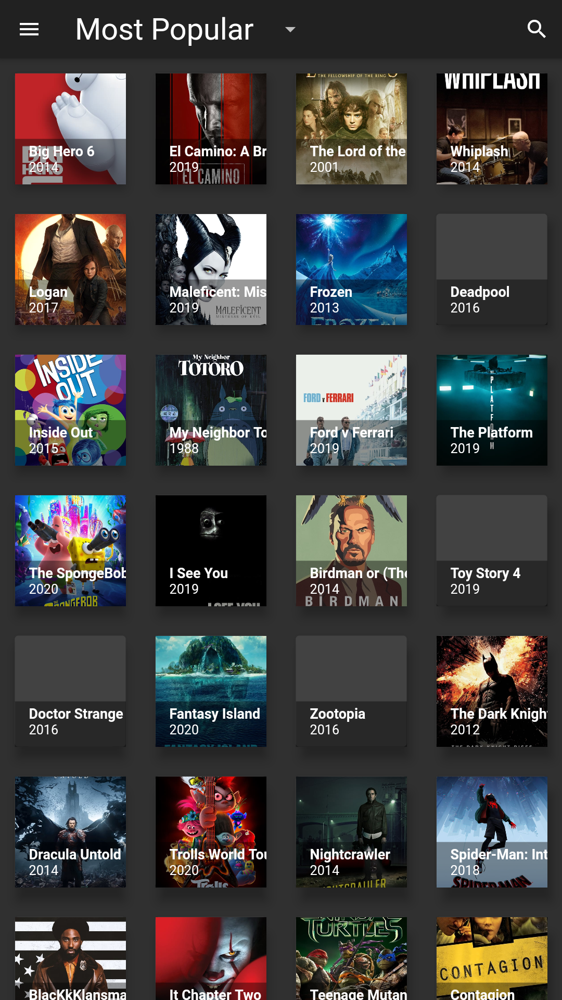

# Live TV and Movie APP

- TV and Movie app that can load .m3u8 files and display live streams through HLS/HTTP links. 
- Uses TMDB API to retrieve movie information such as year, name, and image. 
- Developed 2 versions one with AWS backend and another with Firebase backend.

<h2>Overview of how the app works:</h2>

On-Demand Movie and TV Show Section: 

  <ul>
  <li> The on demand section is split into TV Series and Movies which loads a an initial grid of movies or tv series depending on which the user chooses. The user can also search for Movies or TV Series and the app fetches the "The Movie Data Base" using their API to return all matching movie or tv show names. From there once the user selects the movie/show it brings them to a detail page which has a play button that then scrapes the internet for existing links matching the movie id from different sites and returns those links to play be able to select and play the desired link.
  </ul>

Live TV Channels Section: 

  <ul>
    <li>  The live TV Channel section allows users to watch live TV channels by loading .m3u8 file(s) specified in the settings which contain(s) a list of HLS/HTTP/HTTPS links then displays the channel name on the left and stream of the chosen channel link in a container to the right, the streaming links are abstracted from the user.
  </ul>

 

https://github.com/dordazrodriguez/IPTV-and-Movie-App/assets/79417457/d3fa1633-e1ac-4d77-8e4d-454ae7d89a38

** App may seem sluggish due to it running on an emulated android TV device in the screen recording above. **

<video src="https://github.com/dordazrodriguez/IPTV-and-Movie-App/blob/main/Assets/Screen_Recording_Compressed.mp4" controls="controls" style="max-width: 730px;"></video>

